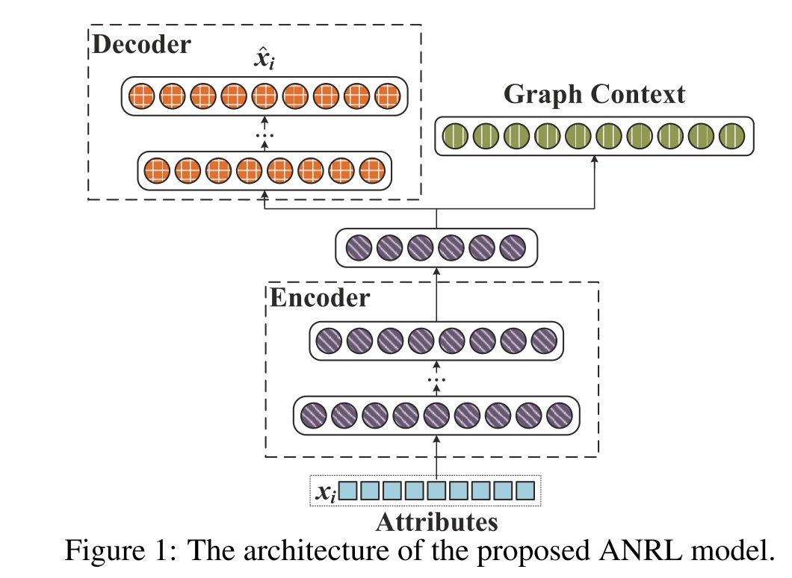
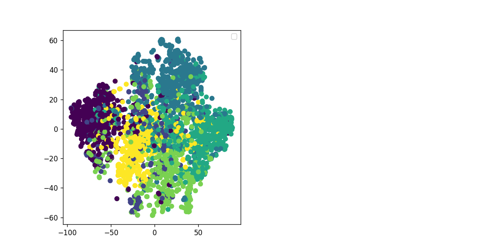
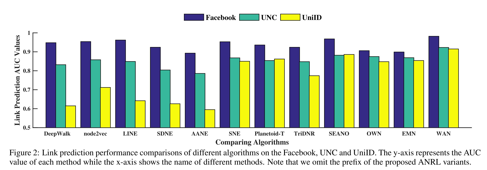
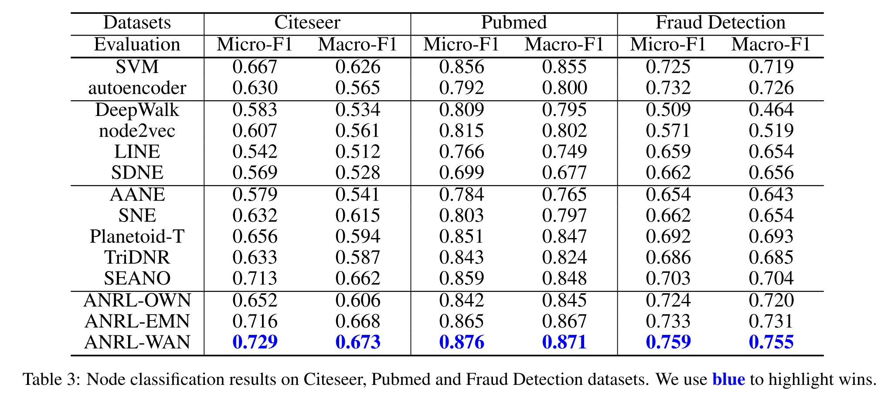

### About me
* **Name**: 叶晨
* **Student ID**: 21821211  
* **Topic**: Neural Networks
* **Email**: ye.chen@zju.edu.cn

### Schedule

| Task | Due | Done |
| :--:| :--: | :--: |
| 1.选择论文 | Mar.14 | √ |
| 2.精读论文 | Mar.21 | √ |
| 3.复现论文 | Apr.4 | √ |
| 4. 完成实验 | Apr.11 | √ |
| 5.撰写报告 | Apr.18 | √ |

### 选择论文
[ANRL: Attributed Network Representation Learning via Deep Neural Networks
](ANRL.pdf)  

* **Abstract**
> Network representation learning (RL) aims to transform the nodes in a network into low- dimensional vector spaces while preserving the in- herent properties of the network. Though net- work RL has been intensively studied, most ex- isting works focus on either network structure or node attribute information. In this paper, we pro- pose a novel framework, named ANRL, to incorpo- rate both the network structure and node attribute information in a principled way. Specifically, we propose a neighbor enhancement autoencoder to model the node attribute information, which recon- structs its target neighbors instead of itself. To capture the network structure, attribute-aware skip- gram model is designed based on the attribute en- coder to formulate the correlations between each node and its direct or indirect neighbors. We con- duct extensive experiments on six real-world net- works, including two social networks, two citation networks and two user behavior networks. The re- sults empirically show that ANRL can achieve rel- atively significant gains in node classification and link prediction tasks.

* **摘要**
> 网络表示学习（RL）的目的是将网络中的节点转化为低维向量空间，同时保持网络的内在属性。尽管对网络工作RL进行了深入的研究，但现有的研究大多集中在网络结构和节点属性信息两个方面。本文提出了一个新的框架，即ANRL，它将网络结构和节点属性信息有机地结合起来。具体地说，我们提出了一种邻域增强自动编码器来对节点属性信息进行建模，它可以重建目标邻域而不是自身。为了捕捉网络结构，设计了基于属性编码器的属性感知跳图模型，用以描述每个节点与其直接或间接邻居之间的关系。我们对六个真实的网络作品进行了广泛的实验，包括两个社交网络、两个引用网络和两个用户行为网络。实验结果表明，在节点分类和链路预测任务中，ANRL能取得显著的效果。

### 精读论文
> 提出ANRL模型，融合了网络结构相似性和节点属性密切关系。具体来说，设计了一个邻居增强自编码器对属性信息建模，并用于重构目标节点的邻居；设计了一个属性感知skip-gram模型来捕获节点和邻居之间的相关性。这两个部分共享编码器的连接层。

> 其中，属性增强自编码器部分目标函数为：$L_{ae}=\sum_{i=1}^n ||\hat{x_i}-T(v_i)||^2_2 $，通过使离得近的节点重构得到相似的目标邻居来使得离得近的节点有相似的表示，其中$\hat{x_i}$是节点$v_i$的邻居经过解码器的重构输出，$T(.)$有两种计算方式：1). 对于给定的节点$v_i$，目标邻居节点由邻居节点的加权平均得到，即$T(v_i)=\frac{1}{|N(i)|} \sum_{j \in N(i)}w_{ij}x_j$. 2). 对于节点$v_i$，$T(v_i)=\breve{x_i}=[\breve{x_1},\breve{x_2}, \dots, \breve{x_m}]$，其中$\breve{x_k}=Median(w_{i1}x_{1k},w_{i2}x_{2k},\dots,w_{i|N(i)|}x_{|N(i)|k})$，即对应邻居节点属性向量的第k维的中位数。

> 属性感知的skip-gram部分的目标函数为：$L_{sg}=-\sum{i=1}^n\sum_{c \in C}\sum_{-b\leq j\leq b,j\neq0}\log p(v_{i+j}|x_i)$，其中，$p(v_{i+j}|x_i)=\frac{exp(v_{i+j}^{'T}f(x_i))}{\sum_{v=1}^n exp(v_{v}^{'T}f(x_i))}$，最终的目标函数为：
$L=L_{sg}+\alpha L_{ae} + \beta L_{reg}$，其中，$L_{reg} = \frac{1}{2}\sum_{k=1}^K(||W^{(k)}||_F^2+||\hat{W^{(k)}}||_F^2)$。值得注意的是，$f(.)$函数就是自编码器的编码器部分，它将节点属性信息转换为隐藏空间的表示$y_i^{(K)}$。

### 复现论文
##### 主要代码
- 损失函数：

```python
def make_skipgram_loss(self):
	loss = tf.reduce_sum(tf.nn.sampled_softmax_loss(
	weights=self.nce_weights,
	biases=self.nce_biases,
	labels=self.labels,
	inputs=self.Y,
	num_sampled=self.config.num_sampled,
	num_classes=self.N))
	return loss   
	
def make_autoencoder_loss(self):
    def get_autoencoder_loss(X, newX):
        return tf.reduce_sum(tf.pow((newX - X), 2))
    def get_reg_loss(weights, biases):
        reg = tf.add_n([tf.nn.l2_loss(w) for w in weights.values()])
        reg += tf.add_n([tf.nn.l2_loss(b) for b in biases.values()])
        return reg
    loss_autoencoder = get_autoencoder_loss(self.X_new, self.X_reconstruct)
    loss_reg = get_reg_loss(self.W, self.b)
    return self.config.alpha * loss_autoencoder + self.config.reg * loss_reg

```
-  迭代训练

```python
for iter_cnt in range(max_iters):
    idx += 1
    batch_index, batch_labels = next(graph_context_batch_iter(all_pairs, batch_size))
    # train for autoencoder model
    start_idx = np.random.randint(0, N - batch_size)
    batch_idx = np.array(range(start_idx, start_idx + batch_size))
    batch_idx = np.random.permutation(batch_idx)
    batch_X = X[batch_idx]
    feed_dict = {model.X: batch_X, model.inputs: batch_idx}
    _, loss_ae_value = sess.run([model.train_opt_ae, model.loss_ae], feed_dict=feed_dict)
    loss_ae += loss_ae_value
    # train for skip-gram model
    batch_X = X[batch_index]
    feed_dict = {model.X: batch_X, model.labels: batch_labels}
    _, loss_sg_value = sess.run([model.train_opt_sg, model.loss_sg], feed_dict=feed_dict)
    loss_sg += loss_sg_value
    if idx % print_every_k_iterations == 0:
        end = time.time()
        print('iterations: %d' % idx + ', time elapsed: %.2f, ' % (end - start), end='')
        total_loss = loss_sg / idx + loss_ae / idx
        print('loss: %.2f, ' % total_loss, end='')
        y = read_label(inputLabelFile)
        embedding_result = sess.run(model.Y, feed_dict={model.X: X})
        macro_f1, micro_f1 = multiclass_node_classification_eval(embedding_result, y, 0.7)
        print('[macro_f1 = %.4f, micro_f1 = %.4f]' % (macro_f1, micro_f1))

```
- 其他代码详见`code`文件夹

### 完成实验


 




### 撰写报告
