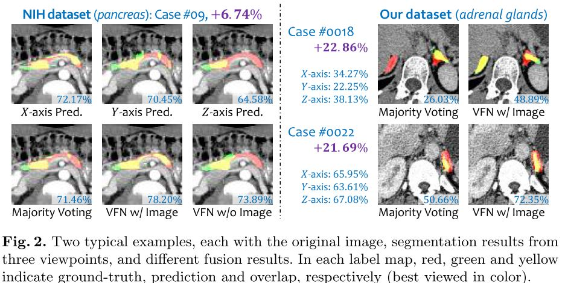
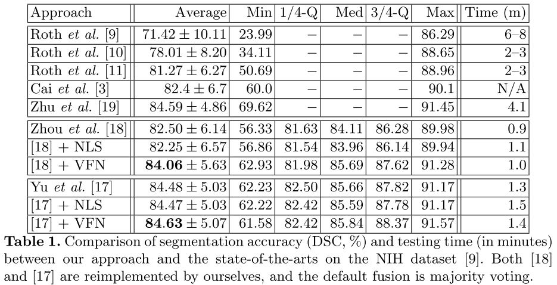
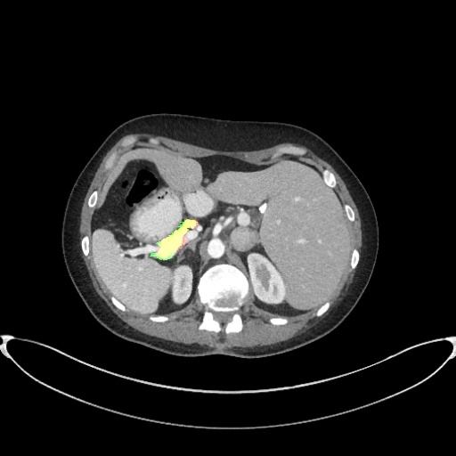
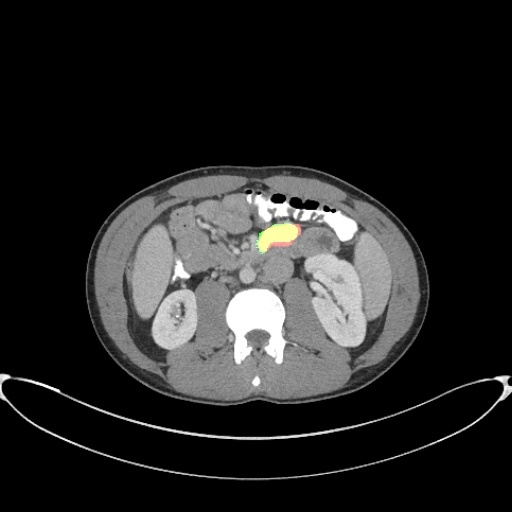
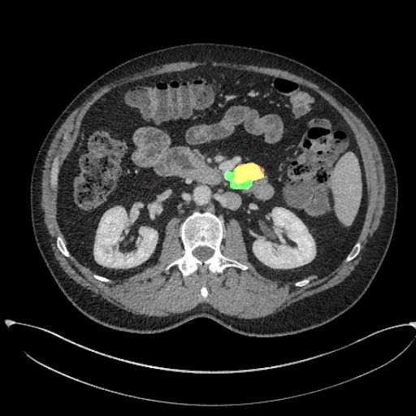

### About me
* **Name**: 周嘉荣
* **Student ID**: 11818381  
* **Topic**: Neural Networks

### Schedule

| Task | Due | Done |
| :--:| :--: | :--: |
| 1.选择论文 | Mar.14 | Y |
| 2.精读论文 | Mar.21 | Y |
| 3.复现论文 | Apr.4 | Y |
| 4. 完成实验 | Apr.11 | Y |
| 5.撰写报告 | Apr.18 | Y |

### 选择论文
[Bridging the Gap Between 2D and 3D Organ Segmentation with Volumetric Fusion Net](Bridging.pdf)

* **Abstract**
> There has been a debate on whether to use 2D or 3D deep neural networks for volumetric organ segmentation. Both 2D and 3D models have their advantages and disadvantages. In this paper, we present an alternative framework, which trains 2D networks on different view-points for segmentation, and builds a 3D Volumetric Fusion Net (VFN) to fuse the 2D segmentation results. VFN is relatively shallow and contains much fewer parameters than most 3D networks, making our framework more effcient at integrating 3D information for
segmentation.We train and test the segmentation and fusion modules individually, and propose a novel strategy, named cross-cross-augmentation, to make full use of the limited training data. We evaluate our framework on several challenging abdominal organs, and
verify its superiority in segmentation accuracy and stability over existing 2D and 3D approaches.

* **摘要**
> 关于是否使用2D或3D深度神经网络进行体积器官分割存在争议。2D和3D模型都有其优点和缺点。在本文中，我们提出了一个替代框架，它在不同的视点上训练2D网络进行分割，并构建一个3D体积融合网络（VFN）来融合2D分割结果。VFN相对较浅，包含的参数比大多数3D网络少得多，使我们的框架更有效地整合3D信息进行分割。我们单独训练和测试分割、融合模块，并提出一种称为交叉增强的新策略，以充分利用有限的训练数据。我们在几个具有挑战性的腹部器官上评估我们的框架，并验证其在分割准确性和稳定性方面优于现有的2D和3D方法。

### 精读论文
> 1.2D和3D模型在进行体积器官分割都有各自的优缺点。因此作者提出一种新的训练模型：Volumetric Fusion Net(VFN),它可以在不同的平面训练2D网络进行分割，同时它包含的参数比大多数3D网络少得多，从而可以更有效的整合3D信息进行分割。
2.VFN结构模式图：只显示一个下采样和一个上采样阶段，但是每个阶段包括3个层面。每个下采样阶段将空间分辨率缩小1/2，但是使通道数增加一倍并且建立了3个高速连接通道。之后，在每个卷积和反卷积层之后执行批量标准化和ReLU激活。
3.作者为了解决训练样本不够的问题，提出了一种cross-cross-augmentation(CCA)的方法。
4.在公开数据库或者自己的数据库进行方法学测试，发现使用VFN这种方法进行腹部器官分割的准确率都优于其他的2D或者3D分割方法。

### 复现论文
> 本文的代码复现详见[/code/](https://github.com/jialei0701/ANN/tree/master/%E5%91%A8%E5%98%89%E8%8D%A311818381/code)文件夹，复现的过程及运行我复现代码所需要的操作详见[/code/README.md](https://github.com/jialei0701/ANN/tree/master/%E5%91%A8%E5%98%89%E8%8D%A311818381/code/README.md)。

### 完成实验

### 撰写报告
