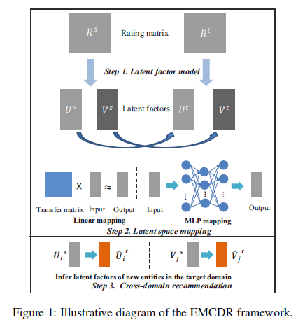
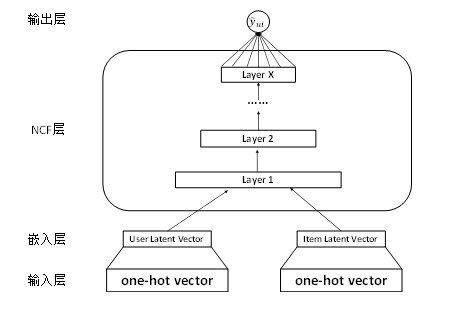

### 生物智能与算法

#### Timeline  

| Task | Due | Done |
| --- | --- | :-: |
| 1. 选择综述论文 | Mar. 14 | √ |  
| 2. 精读论文，理解模型 | Mar. 21 | √ |  
| 3. 复现论文 | Apr. 4 |  |  
| 4. 完成对比实验 | Apr. 11 |  |  
| 5. 形成最后报告 | Apr. 18 |  |  

#### Mar. 14  
选择推荐系统领域的两篇论文进行综述，分别为
> Man T, Shen H, Jin X, et al. Cross-Domain Recommendation: An Embedding and Mapping Approach[C]//IJCAI. 2017: 2464-2470.

> He X, Liao L, Zhang H, et al. Neural collaborative filtering[C]//Proceedings of the 26th International Conference on World Wide Web. International World Wide Web Conferences Steering Committee, 2017: 173-182.

其中第一篇论文从嵌入和映射角度对跨域推荐系统进行研究，即在不同域之间学习一个域间映射函数，继而解决跨域推荐中存在的数据异构问题。
本文提出的EMCDR框架与现有的跨域推荐系统存在两方面的不同：首先，使用多层神经网络实现跨域的非线性映射，非线性映射为单域实体提供了更灵活的学习算法。其次，只有拥有数据充分的实体被用来学习映射函数，因此该模型对单域数据中噪声具有鲁棒性。
简单来说，EMCDR可以分为三个部分，首先是分别对不同域的用户和物品进行特征建模，其次使用神经网络对两个域间共享特征进行映射，最后实现跨域推荐。

第二篇论文针对协同过滤推荐中的经典算法——概率矩阵分解(Probabilistic Matrix Factorization)提出改进的深度神经协同过滤(NCF)。本文认为，传统的矩阵分解方法使用线性方法(点乘)来描述用户和物品之间的交互关系，这是不够充分的。因此提出了使用神经网络来学习用户-物品的交互函数，从而实现用户特征和物品特征之间的非线性组合。

本次课程探究我将采用EMCDR框架，并借鉴NCF思想，改进EMCDR框架，以此探究深度学习在跨域推荐系统中的作用。

#### Mar. 20  
#### > Man T, Shen H, Jin X, et al. Cross-Domain Recommendation: An Embedding and Mapping Approach[C]//IJCAI. 2017: 2464-2470.

这篇论文提出了一个基于嵌入和映射的跨域推荐框架(Embedding and Mapping framework for Cross-Domain Recommendation, 简称EMCDR)。  
框架结构如下  

该框架假设有两个共享用户和/或物品的域，并且只在其中一个域出现的用户/物品可以视为另一个域中潜在的用户/物品。该场景下，两个域间也有共享的用户和物品。不是一般性，将其中一个域视为源域，另一个做为目标域。设U={u_1,u_2,…} 和V={v_1,v_2,…}分别为用户和物品的集合，Rs和Rt分别为源域和目标域的评分矩阵，且Rs_ij代表源域中u_i对v_j的评分，Rt_ij代表目标域中u_i对v_j的评分。

给定两个部分观察矩阵Rs和Rt，和跨域用户集与物品集，本文旨在利用跨域信息为数据稀疏的用户/物品作出推荐。为此，提出了EMCDR模型，该框架分为三层，分别为潜在因素建模、潜在空间映射和跨域推荐。
第一层通过潜在因素模型找出用户和物品在潜在空间的表示。潜在因素模型假设存在一个与每个用户和每个物品都相关的因素，所观察到的用户评分矩阵实际上是用户和物品潜在因素相互作用的结果。潜在空间中用户和物品的因素可以表示为特征向量。定义源域和目标域中学到的潜在因素分别为{Us  ,Vs}和{Ut  ,Vt}。这里使用的是常用的概率矩阵分解(PMF)来学习潜在因素。

第二层通过映射函数对用户/物品的关于关系进行建模。假设源域和目标域的用户/物品特征向量之间存在着一种潜在的映射关系，并进一步使用映射函数来捕获这种关系。即设用户u_i在两个域中分别有特征向量Us_i和Ut_i，通过映射函数f(∙;θ)获得跨域关系Ut_i=f(Us_i;θ)，其中θ是该函数的参数。本文采用了线性映射以及基于MLP的非线性映射来处理这个过程。线性映射即将映射函数f看作一个变换矩阵；非线性映射使用MLP实现域间的数据映射。并且文章通过实验证明，采用MLP的非线性映射能够得到比线性映射更好的效果。

最后，即模型的第三层，为目标域中的一个新用户/物品提供推荐。利用源域中的潜在因子和映射函数，得到目标域中相应的潜在因子，再基于这个放射潜在因子就能完成跨域推荐。

#### > He X, Liao L, Zhang H, et al. Neural collaborative filtering[C]//Proceedings of the 26th International Conference on World Wide Web. International World Wide Web Conferences Steering Committee, 2017: 173-182.

本文提出的跨域推荐系统方法。首先是提出了一种新的特征向量计算方法——深度矩阵分解，深度矩阵分解遵循协同过滤的思想，只需要遍历一次用户的历史行为，就能得到对应的用户特征矩阵与物品特征矩阵。  
NCF框架如下  

然而原始的NCF以用户隐式反馈作为神经网络的输入，并且使用用户和物品的one-hot编码作为输入，通过嵌入层将高维稀疏向量转化为低维稠密向量。为了将其融入EMCDR框架中，本次课程项目计划在NCF基础上，提出将显式反馈数据作为训练数据集的神经矩阵分解方法，即NMF。
使用NMF进行矩阵分解可以将用户历史行为体现在用户特征向量和物品特征向量上，并且用户特征向量与物品特征向量可以视情况具有不同的维度。最后使用深度神经网络学习用户-物品交互函数，实现了用户特征和物品特征之间的非线性组合。对比于传统的矩阵分解算法大多采用固定用户-物品交互函数，之后通过不断优化特征向量，得到特征矩阵。本文提出的NMF则首先固定特征向量的表达形式，通过优化用户-物品交互函数，达到对潜在空间建模的目的。
NMF框架如下  

