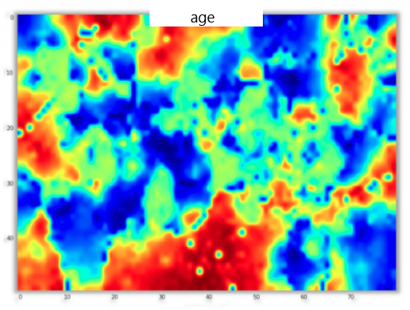
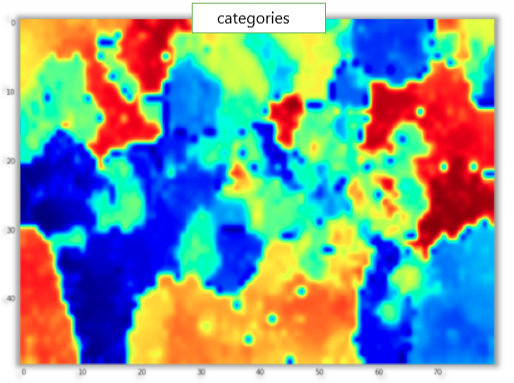
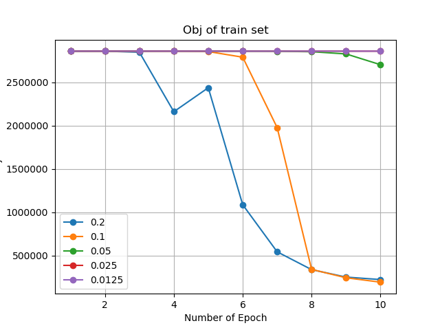
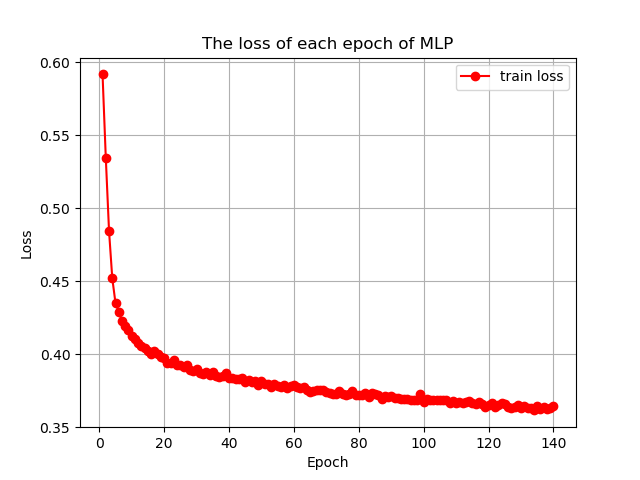
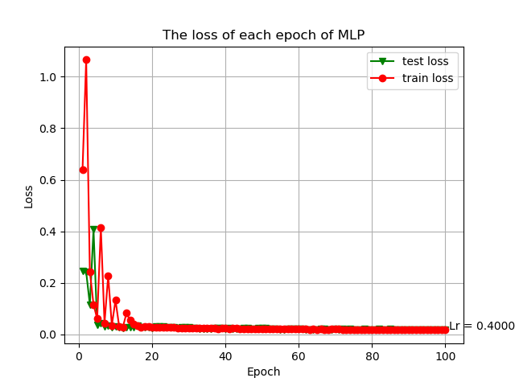
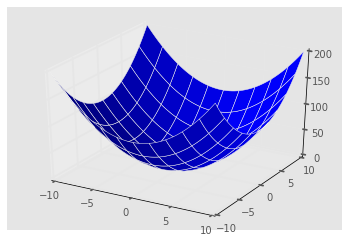

### 实验结果与分析
#### 数据预处理
NMF_EMCDR需要使用物品和用户属性进行用户和物品特征矩阵建模，然而除MovieLens数据集外，目前大多数公开数据集大多对用户进行了脱敏处理，实验时间紧迫，来不及爬取其他数据源。综合以上原因，本实验采用拥有1,000,000评分数据的MoiveLens 数据集作为实验数据。MoiveLens 数据集是从MovieLens 网站收集的用户对电影的评分数据集，评分模式为1-5分之间的任何一个整数。本实验使用的MovieLens-1m数据集收集于2000年，数据集中包括1，000，209个评分数据，来自6040个用户对大约3900部电影的评分数据，并且经过筛选，本数据集中每个用户都有20个以上的评分数据。  
除了评分数据外，本数据集还包含以下信息：
* 用户信息：包括每个用户的性别、年龄段以及职业。
* 电影信息：包括电影的标题(来自IMDB)，发布年份以及电影的分类标签，其中每个电影包含一个或一个以上的分类标签。  

为实现物品重叠的推荐场景，本实验将原始的MovieLens 数据集根据用户划分为两个部分，分别作为源域和目标域。为了验证预测结果，在目标域中抽取10%的物品作为验证集，在目标域中删除这些物品的所有评分数据。

#### 实验结果
实验可以分为两个部分，首先是通过第一部分的实验，证明NMF_MLP_EMCDR模型与传统EMCDR模型、单域推荐相比，在预测精确度上有所提升。说明了使用NMF方法在性能上优于PMF，跨域推荐系统面临数据稀疏问题时，明显优于单域推荐。  
通过第二部分的实验，证明NMF_MLP_EMCDR在预测性能上优于NMF_LIN_EMCDR。
##### 实验一  
在实验中，随机抽取目标域中10%的电影作为测试集，删除这些电影的所有评分数据，将这些电影作为冷启动物体测试模型性能。最后，使用RMSE评估评分预测每次实验的准确度。  
同时，为了避免训练数据稀疏度对实验结果的影响，本文分别对原始数据集进行10次随机的数据域划分，形成10组具有不同数据稀疏程度的源域和目标域的数据集合，分别使用这些数据进行模型训练。最后，使用每个模型的10组实验得到的RMSE的平均值作为该模型的实验结果。  
10次实验中不同模型的预测性能如下：  

| 实验编号 | simplePMF | PMF_EMCDR | NMF_MLP_EMCDR |
| --- | --- | --- | :-: |
| 1 | 3.7528 | 1.3094 | 1.0986 |
| 2 |	3.7985 | 1.0437 | 1.1430 |
| 3 |	3.7290 | 1.2423 | 1.1572 |
| 4 |	3.7272 | 1.2222 | 1.1076 |
| 5 |	3.8154 | 1.2195 | 1.1863 |
| 6 |	3.7699 | 0.9986 | 1.1967 |
| 7 |	3.7680 | 1.2946 | 1.1095 |
| 8 |	3.7421 | 0.9992 | 1.1303 |
| 9 |	3.6767 | 1.0656 | 1.1786 |
| 10 |	3.7896 | 1.1901 | 1.1388 |
| 平均值 |	3.7569 | 1.1585 | 1.1447 |

根据实验数据，可以看出，在数据稀疏的目标域中，simplePMF的预测效果误差很大，使用跨域推荐系统能够大幅提高预测性能。因此，可以看出，跨域推荐系统确实能够在很大程度上缓解单域推荐系统中的数据稀疏问题和冷启动问题。此外，根据NMF_MLP_EMCDR与PMF_MLP_EMCDR模型的预测准确度，可以看出，使用NMF方法进行特征矩阵描述与用户-物品交互函数学习，相比于使用PMF与内积作为用户-物品交互函数，在跨域推荐的预测准确度性能上有少许的提高。同时从上表可以得知，使用NMF方法的模型表现比较稳定。

##### 实验二
本组实验使用NMF_LIN_EMCDR与NMF_MLP_EMCDR进行对照试验。随机选取目标域中10%的用户作为冷启动用户，用以测试模型效果，使用RMSE作为评估标准。  
为控制变量，两个模型共享NMF方法，即使用同样的用户特征矩阵、物品特征矩阵作为映射函数的输入，以及使用同样的用户-物品交互函数处理映射函数的输出。  
同时，为了避免数据稀疏给实验带来的影响，本实验同样随机划分10次源域与目标域，形成10组不同的测试数据，并取10组测试数据的预测准确率的平均值作为模型的预测准确度。

| 实验编号 | 	NMF_MLP_EMCDR |	NMF_LIN_EMCDR |
| --- | --- | --- |
| 1 |	1.0986 | 1.7985 |
| 2 |	1.1430 | 1.1334 |
| 3 |	1.1572 | 1.1320 |
| 4 |	1.1076 | 1.1480 |
| 5 |	1.1863 | 1.1718 |
| 6 |	1.1967 | 1.1215 |
| 7 |	1.1095 | 1.1132 |
| 8 |	1.1303 | 1.1042 |
| 9 |	1.1786 | 1.1201 |
| 10 |	1.1388 | 1.1457 |
| 平均值 |	1.1447 | 1.1988 |

从实验数据中，可以看出，使用MLP实现域间映射相比使用线性域间映射函数具有更好的性能表现，平均性能提升达到4.51%。由此可以认为，非线性的潜在空间映射函数可以更好描述域间特征向量的知识迁移。

#### 可视化分析
这里使用SOM方法进行可视化分析。  
SOM(Self-organizing Maps)和ANN(MLP)模型在结构上类似，都由非常简单的神经元结构组成，但是SOM是一类“无监督学习”模型，一般的用法是将高维的input数据在低维的空间表示。
SOM是一种竞争性神经网络，不同于MLP以网络的误差作为算法的准则，SOM假设神经元之间存在拓扑关系，并且采用的是“胜者为王”的策略。SOM只由输入层和隐藏层构成，即对于每个输入的向量，都有一个对应的最强的隐藏层神经元作为胜者。在之后的权值调整中，其兴奋程度会得到加强。
在本实验中，使用50 * 80的隐藏层对PMF学到的特征向量进行聚类，使用的相似性度量方法为内积。通过SOM训练得到聚类结果，可视化显式的标签(如年龄)与其潜在特征向量的聚类结果。
将不同聚类结果集合里的特征向量的年龄属性取平均值，得到的图表如下

  

将不同聚类结果集合里的特征向量的电影类别属性取平均值，得到的图表如下  

相同颜色区域的面积越大，代表该属性与特征向量的数据分布相关性越强。

#### 损失函数分析
框架主要部分的训练过程loss函数的变化分别如下图：  
PMF(不同的学习率情况下)  
  
MLP  

pmf_mlp框架的训练过程中loss函数变化如图：  

对以上模型进行loss仿真：  

