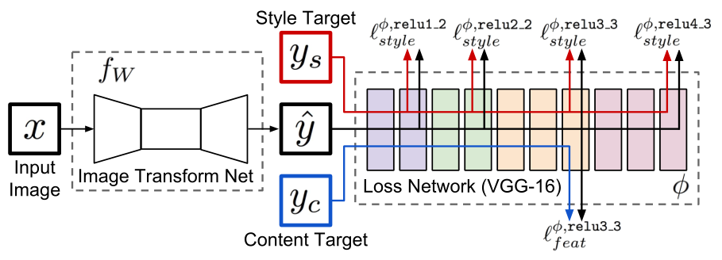
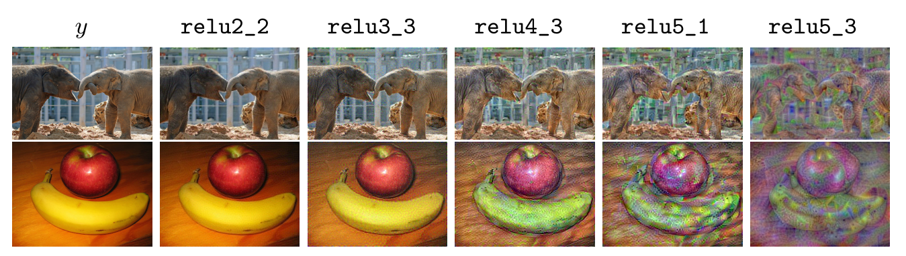
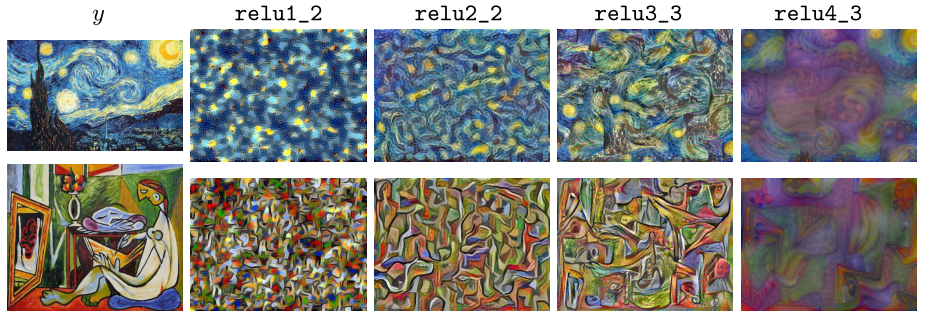
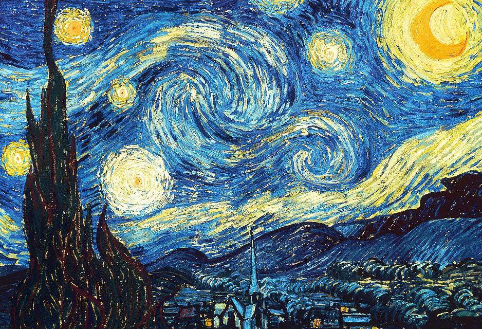
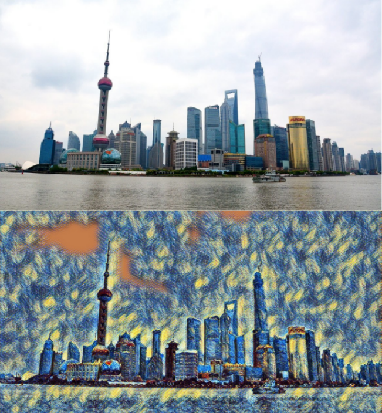
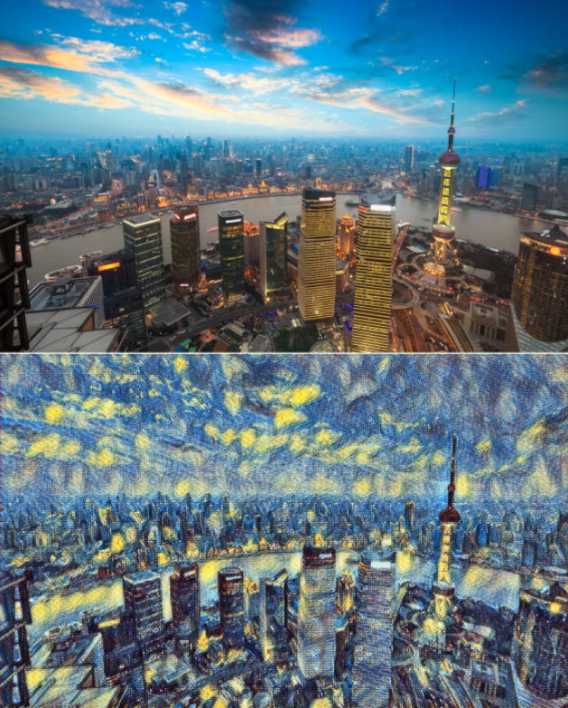
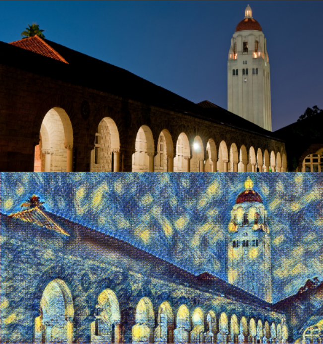
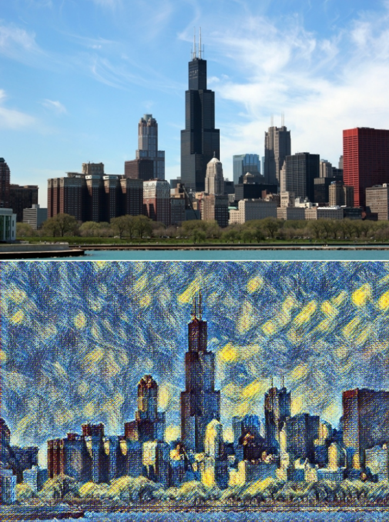

# 生物智能算法 神经网络组

# 因为 github markdown 不支持LaTex公式，报告请参见 [README.pdf](README.pdf)
## 个人信息

姓名：艾家磊 
学号：21821149 
邮箱：[3287967219@qq.com](mailto:3287967219@qq.com) 

## 时间安排

| Task       | Date   | Done |
| ---------- | ------ | ---- |
| 1.选择论文 | Mar.14 | √    |
| 2.精读论文 | Mar.21 | √    |
| 3.复现论文 | Mar.28 | √    |
| 4.结果分析 | Apr.4  | √    |
| 5.完成报告 | Apr.11 |      |

## 1.选择论文

**Title**

> 《Perceptual Losses for Real-Time Style Transfer and Super-Resolution》

**Abstract**

> We consider image transformation problems, where an input image is transformed into an output image. Recent methods for such problems typically train feed-forward convolutional neural networks using a per-pixel loss between the output and ground-truth images. Parallel work has shown that high-quality images can be generated by defining and optimizing perceptual loss functions based on high-level features extracted from pretrained networks. We combine the benefits of both approaches, and propose the use of perceptual loss functions for training feed-forward networks for image transformation tasks. We show results on image style transfer, where a feed-forward network is trained to solve the optimization problem proposed by Gatys et al in real-time. Compared to the optimization-based method, our network gives similar qualitative results but is three orders of magnitude faster. We also experiment with single-image super-resolution, where replacing a per-pixel loss with a perceptual loss gives visually pleasing results.

摘要

> 在图像转换问题中，输入图像通过一系列转换转化为输出图像。目前大多数方法都是训练一个前馈卷积神经网络，这个网络利用 per-pixel 损失函数计算输出图片和真实图片的差异。其他工作表明，通过利用 perceptual 损失函数来优化预训练网网络的高级图像特征去计算图像间的差异，可以得到更高质量的图片。通过结合了这两种方法，我们实现了更高效的风格迁移模型。在风格迁移中，通过训练前馈网络来实时解决 Gatys 提出的优化问题。与基于优化的方法相比，该网络的速度提高了三个数量级

## 2.精读论文

### 数据集

本文所用的数据集为 COCO 数据集。

### 模型结构



如图所示，我们的系统分为两部分：一个图片转换网络$f_w$和一个用来定义 loss 函数$(ℓ_1,…,ℓ_k)$的 loss 网络。图片转换网络是一个深度残差卷积神经网络，它的权值参数是$𝑊$，它利用映射$\hat{y} = 𝑓_w(𝑥)$来将输入图像$x$转换成输出图像$\hat{y}$。loss 网络是训练好的图像分类网络（VGG），它定义了 perceptual 损失函数，该函数描述图片之间内容和风格的差距。loss 网络在整个训练过程中参数保持不变。每个 loss 函数都计算出一个标量值$ℓ_i(\hat{y},y_i)$，该值衡量输出图像与目标图像的差距。图片转换网络使用随机梯度下降的方式来最小化总loss函数。这个总loss函数是各个loss函数的带权合并，如
$$
W^{*}=\arg \min _{W} \mathbf{E}_{x,\left\{y_{i}\right\}}\left[\sum_{i=1} \lambda_{i} \ell_{i}\left(f_{W}(x), y_{i}\right)\right]
$$
loss网络$∅$定义**特征重建loss $\ell_{\text {feat}}^{\emptyset}$**以及**风格重建loss** $\ell_{\text {style}}^{\emptyset}$分别衡量图片内容与风格上的差异。对于特定的输入图像$𝑥$，我们有 content target $y_c$和 style target $y_s$。对于风格转换部分，输入$𝑥$就是content target $ y_c$，输入的风格图像就是style target $ y_s$。输出的图像$\hat{y}$应该具有$𝑥 = y_c$的内容与$ y_s ​$的风格。

### Perceptual Loss  函数

我们尽可能地生成与原图像相似的特征表示，该特征表示使用 loss 网络$∅$提取出来（本
文中的 loss 网络是 VGG16）。我们使用$∅_j(𝑥)$来表示 loss 网络$∅$的输入是$𝑥$时的第$j$层网
络激活层。如果 $j$ 是一个卷积层，那么$∅_j(𝑥)$是一个 shape 为$C_j∗ 𝐻_j ∗ 𝑊_j​$ 的特征图。那
么特征重建 loss 就是特征表示的欧氏距离：
$$
\ell_{\text {feat}}^{\phi, j}(\hat{y}, y)=\frac{1}{C_{j} H_{j} W_{j}}\left\|\phi_{j}(\hat{y})-\phi_{j}(y)\right\|_{2}^{2}
$$
如下图所示，如果我们使用网络的浅层最小化特征重建loss，得到的图像跟原图几乎没差。而本文使用网络的深层，这样图像的内容和空间结构都保留下来，而颜色、纹理以及精密的形状则会丢失。



### 风格重建 loss

特征重建 loss 得到的是图像的内容，而丢失了图像的颜色和细节等。这些都是由风格图像提供的，所以我们也需要得到它们。我们定义 Gram 矩阵$𝐺_j^∅ (x)$为$𝐶_j ∗
𝐶_j ​$的矩阵：
$$
G_{j}^{\phi}(x)_{c, c^{\prime}}=\frac{1}{C_{j} H_{j} W_{j}} \sum_{h=1}^{H_{j}} \sum_{w=1}^{W_{j}} \phi_{j}(x)_{h, w, c} \phi_{j}(x)_{h, w, c^{\prime}}
$$
我们可以将$∅_j(𝑥)$重构成一个$𝐶_j ∗ 𝐻_j ∗ 𝑊_j $的矩阵$ψ$，那么$G_{j}^{\phi}(x)=\psi \psi^{T} / C_{j} H_{j} W_{j}$。风格重建 loss 等于输出与目标图像的 Gram 矩阵的差值的 Frobenius 范数的平方。即：
$$
\ell_{\text {style}}^{\phi, j}(\hat{y}, y)=\left\|G_{j}^{\phi}(\hat{y})-G_{j}^{\phi}(y)\right\|_{F}^{2}
$$
如下图所示，当我们最小化风格重建loss的时候，几层指定的网络输出的结果保留了目标图像的风格特征而丢失了空间结构。越深的网络层次提取到越大尺度的特征。为了从多层网络J中进行风格重建，我们定义$$
l_{s t y l e}^{\phi, J}(\hat{y}, y)
$$为多层网络生成loss的总和，其中$j \in J​$。



## 复现论文

本文的图像转换网络使用 [[1]][1] 提出的网络，不使用池化层，而使用一种新型卷积方式（strided convolutions）和反卷积在网络中进行上采样和下采样。我们的网络体由 [[2]][2] 用到的 5 个残差块组成，所有的非残差卷积层之后都进行空间批处理标准化以及 ReLU 激活函数以保证图像的像素值在[0,255]之间。除了第一层和最后一层使用 9\*9 的卷积核之外，其他卷积层都使用 3\*3 的卷积核。

### 输入与输出

训练时，对于风格转换的输入和输出都是 3 \* 256 \* 256的彩色图像。对于上采样因子为$𝑓$的超分辨率，输出是一个高分辨率的图像 3 \* 288 \* 288，输入是低分辨率图像$3 ∗ 288/𝑓 ∗ 288/𝑓$。因为图像转换网络是全卷积的，在测试的时候可以使用任何分辨率图像作为输入。

### 上采样和下采样

对于上采样因子为$𝑓$的超分辨率，我们在$log_2𝑓​$个 1/2 步长的卷积层之后使用残差块。对于图像转换网络，我们在残差块之后使用两个步长为 2 的卷积层用来对输入下采样然后再使用两个 1/2 步长的卷积层来上采样。

### 残差连接

文献[[3]][3]提出使用残差连接训练深度网络对图像进行分类，提出残差连接可以使网络轻易地具有识别功能。所以我们的网络体由几个残差块组成，每个残差块包含3\*3的卷积层。我们使用[[2]][2]中的残差块设计。

### 实验环境

本文实现所用的实验环境:

- python 3.5
- Tensorflow 1.1

### 自己的实现步骤

代码见 [code](code/) 文件夹。 

#### 训练步骤：

- 1.下载 [vgg16.ckpt](http://download.tensorflow.org/models/vgg_16_2016_08_28.tar.gz)，并放在代码同级文件夹下，命名为'vgg_16.ckpt'。

- 2.下载 [COCO数据集](http://msvocds.blob.core.windows.net/coco2014/train2014.zip)，假设解压后的文件夹路径为 '/path/to/train/'。

- 3.准备好一张风格图像，图像大小不限制，最好使用256*256左右的分辨率图像，假设图像路径为 '/path/to/style.jpg'。

- 4.配置好环境之后，运行命令：

  ```bash
  # train.py程序接受两个命令行参数，第一个是风格图像的路径，第二个是训练的数据集的路径。
  python train.py /path/to/style.jpg /path/to/train/
  ```

- 5.在训练期间，可以使用tensorboard查看训练过程：

  ```bash
  tensorboard --logdir=models/log/
  ```

- 6.训练结束后，在model/log目录下，找到'fast-style-model.ckpt-done'开头的四个文件，这就是最终保存的模型。

#### 测试步骤：

- 1.假设需要转换的图像路径是'img/test.jpg'，训练模型的保存路径是'model/log/'，那么运行命令：

  ```bash
  # eval.py程序接受两个命令行参数，第一个是测试图像的路径，第二个是模型保存的路径。
  python eval.py img/test.jpg model/log/fast-style-model.ckpt-done
  ```

- 2.生成的结果在'generated/res.jpg'。

## 结果分析

在配置好实验环境之后，我们需要准备一个风格图像，在本实验中，我们准备如下图所示的风格图像。



然后我们运行 train.py 对模型进行训练，在训练的过程中，我们可以使用 tensorboard 来查看训练进程。

在配置好实验之后，我们抽取4组图片来测试模型的有效性，这4组图片如下图所示，其中的每组图片，上图是输入，下图是风格迁移之后的结果。

- 风格迁移图片（1）



- 风格迁移图片（2）



- 风格迁移图片（3）



- 风格迁移图片（4）



从图中我们可以看到，我们训练出来的模型效果很好，图片迁移转换后的图片和风格图片的风格几乎是一模一样。同时在测试过程中，我们记录测试图片输入模型到产生结果的时间差如下图所示：

| 测试图片          | 测试时间  |
| ----------------- | :-------- |
| 风格迁移图片（1） | 2.627362s |
| 风格迁移图片（2） | 2.966539s |
| 风格迁移图片（3） | 2.023131s |
| 风格迁移图片（4） | 2.090037s |

从表中我们可以看到，该模型的运行时间很短，大多控制在3s内，相比前人提出的算法，有显著的速度提升。

## 形成报告


## 参考文献

[1] Radford, A., Metz, L., Chintala, S.: Unsupervised representation learning with deep convolutional generative adversarial networks. arXiv preprint arXiv:1511.06434 (2015)

[2] Gross, S., Wilber, M.: Training and investigating residual nets.http://torch.ch/blog/2016/02/04/resnets.html (2016)
[3] He, K., Zhang, X., Ren, S., Sun, J.: Deep residual learning for image recognition. arXiv preprint arXiv:1512.03385 (2015)
