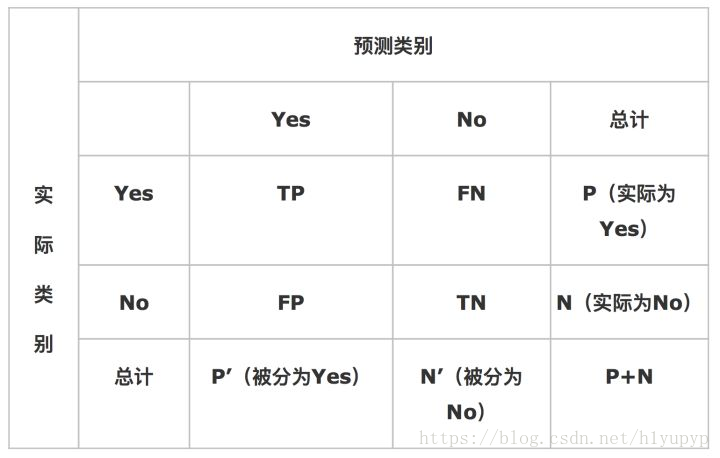
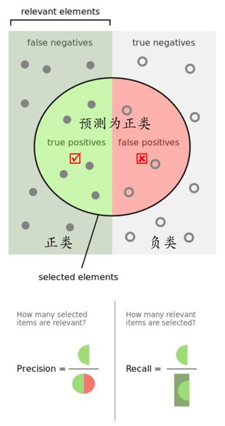
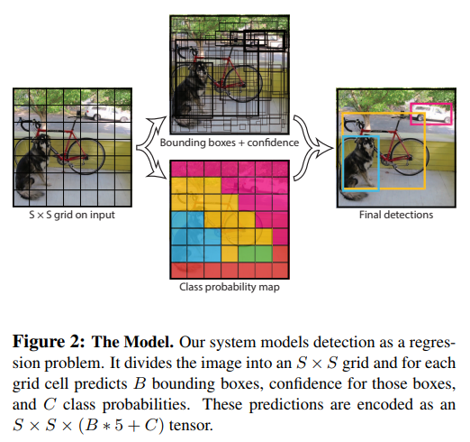
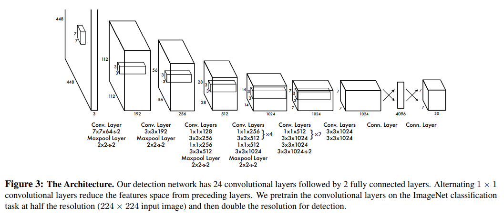
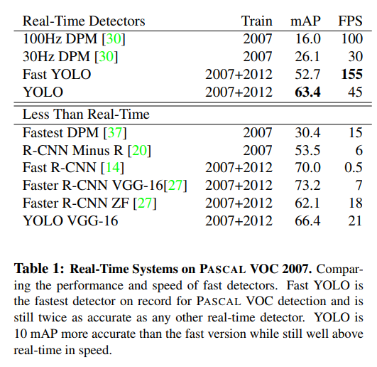
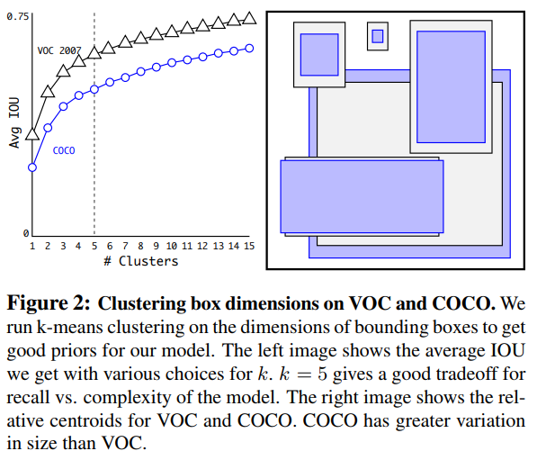
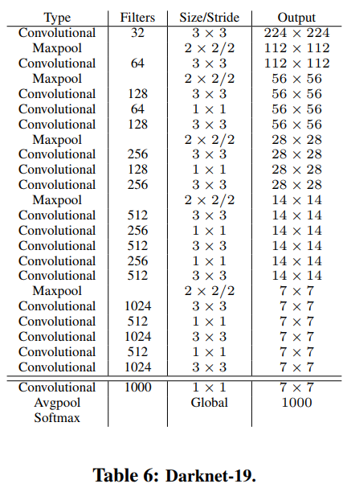
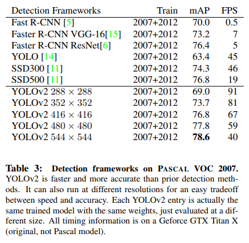
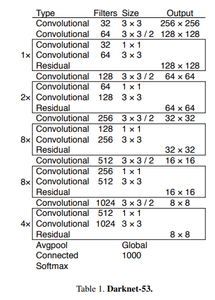
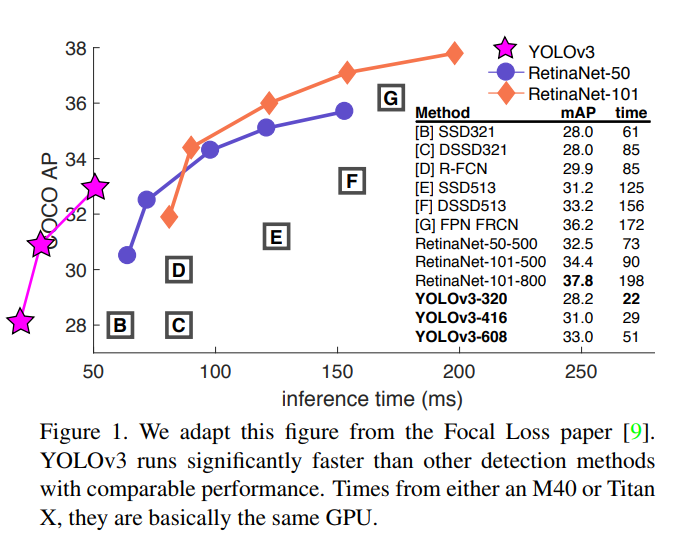

# 生物智能与算法

## Personal Information
* **Name**: 赵昱  
* **Student ID**: 21821275
* **E-Mail:**: 21821275@zju.edu.cn
* **Topic**: Real Time Object Detection Using CNN

## Schedule
| Task | Due | Done |
| :-- | :-: | :-: |
| 1. 选择论文 | Mar. 14 | &radic; |
| 2. 精读论文，理解模型 | Mar. 21 | &radic;  |
| 3. 复现论文 | Apr. 4 |  |
| 4. 完成对比实验 | Apr. 11 |  |
| 5. 形成最后报告 | Apr. 18 |  | 

## 1. 选择论文
查看阶段报告:[Tex](report1-21821275.tex)，[PDF](report1-21821275.pdf)

目标检测问题分为两个阶段，即目标定位（确定目标所在位置，回归问题）
和目标分类（确定候选框内的目标所属类别），常规方法通常采用滑动窗口加人工
特征分类器进行检测。

`YOLO`系列是首个使用单个CNN模型同时处理回归和分类两个问题的神经网络模型。

本项目选择`YOLO`系列作为多类别目标检测（通常叫做通用目标检测）所采用的模型，尝试复现每个版本并进行比较，同时针对
一些特殊应用（如人脸检测等单类别问题），根据自己的需求训练模型。

[[YOLO v1-CVPR2016] You Only Look Once: Unified, Real-Time Object Detection](https://www.cv-foundation.org/openaccess/content_cvpr_2016/papers/Redmon_You_Only_Look_CVPR_2016_paper.pdf)  
[[YOLO v2-CVPR2017] YOLO9000: Better, Faster, Stronger](http://openaccess.thecvf.com/content_cvpr_2017/papers/Redmon_YOLO9000_Better_Faster_CVPR_2017_paper.pdf)  
[[YOLO v3-(arxiv)2018] YOLOv3: An Incremental Improvement](https://arxiv.org/pdf/1804.02767)  

## 2. 精读论文，理解模型
- 2.1 目标检测问题模型和求解思路
    目标检测问题要求检测到某类物体在图像中是否存在，并且给出其所在位置的包围框（Bounding Box）。
    
    目标检测问题的模型分为两个阶段，即目标定位（确定目标所在位置，回归问题）
和目标分类（确定候选框内的目标所属类别）。

    常规方法的第一个阶段通常采用滑动窗口的方法来穷举包围框，由于物体的大小不一，滑动窗口的尺寸也会不断变化（在具体实现上，是通过缩放图像，如计算图像金字塔实现的）

    在此基础上，使用人工特征分类器进行检测（分类），如使用基于Haar特征的分类器判断是否为人脸，基于HOG特征的分类器判断是否为行人等。

    对于常规方法的改进，通常可以从这两个阶段着手。如针对目标定位的改进，有RCNN的Selective Search，Fast RCNN的Region Proposal，或直接将其看成一个回归问题。针对分类器的改进，则通常使用更高层次或更复杂的特征，如使用CNN提取的特征。但是根据包围框候选策略得到的包围框通常不会完全贴合目标的边缘，所以很多方案会进行Bounding Box Regression（位置精修），来得到更加准确的包围框。
    
- 2.2 评估标准
    常见的分类问题，通常使用混淆矩阵来表示分类的结果，即每个类别被分类的结果与真实结果的对比，如下图：
    

    对于二分类的混淆矩阵，可以计算召回率（Recall）、精确率（Precision），前者是真实样本被检出的概率，后者则是检出的准确率。
    
    
    在此基础上，还可以计算PR曲线，ROC曲线，F指标等。

    以上是针对分类算法的判别标准，评价一个检测算法时，主要看两个指标，即是否正确的预测了框内物体的类别；预测的框和人工标注框的重合程度，故需要以下两个评价标准：
    - IOU(Intersection Over Union): 用来衡量预测的物体框和真实框的重合程度（通常我们规定IOU > 0.5表示物体被检测出来，否则没有。调整IOU的阈值可以得到PR曲线。）
    - 平均精度均值(Mean Average Precision，mAP):mAP即是把每个类别的AP都单独拿出来，然后计算所有类别AP的平均值，代表着对检测到的目标平均精度的一个综合度量。（AP的计算方法之一：11点插值法。就是选取0,0.1,0.2…1，这样的11个点，分别对应不同的recall级别，根据不同的级别计算最大Precision（最大是指左侧最大），然后求出它的平均值。）
    
- 2.3 [[YOLO v1-CVPR2016] You Only Look Once: Unified, Real-Time Object Detection](https://www.cv-foundation.org/openaccess/content_cvpr_2016/papers/Redmon_You_Only_Look_CVPR_2016_paper.pdf)  
    - 2.3.1 方法
        单阶段（one-stage）目标检测。YOLO将目标检测重新定义为单个回归问题，从图像像素直接到边界框坐标和类概率。
        
    - 2.3.2 特色
    (1)在预训练的时候用的是224*224的输入，一般预训练的分类模型都是在ImageNet数据集上进行的，然后在检测的时候采用448*448的输入
    (2)在图像上运行单个卷积网络；
    (3)根据模型的置信度对得到的检测进行阈值化。(输出为BB+类概率)
    
    - 2.3.3 结果
    

- 2.4 [[YOLO v2-CVPR2017] YOLO9000: Better, Faster, Stronger](http://openaccess.thecvf.com/content_cvpr_2017/papers/Redmon_YOLO9000_Better_Faster_CVPR_2017_paper.pdf)  
    - 2.4.1 方法
    同上。
    - 2.4.2 特色
    (1)Batch Normalization
    (2)High Resolution Classifier：预训练分成两步：先用224*224的输入从头开始训练网络，大概160个epoch，然后再将输入调整到448*448，再训练10个epoch。最后再在检测的数据集上fine-tuning，也就是检测的时候用448*448的图像作为输入就可以顺利过渡了。
    (3)Convolutional With Anchor Boxes
    
    (4)Dimension Clusters：Faster R-CNN中anchor box的大小和比例是按经验设定的，然后网络会在训练过程中调整anchor box的尺寸。
如果一开始就能选择到合适尺寸的anchor box，那肯定可以帮助网络更好地预测。所以作者采用k-means的方式对训练集的bounding boxes做聚类，试图找到合适的anchor box。
    
    - 2.4.3 结果
    

- 2.5 [[YOLO v3-(arxiv)2018] YOLOv3: An Incremental Improvement](https://arxiv.org/pdf/1804.02767)    
    - 2.5.1 方法
    同上。
    - 2.5.2 特色
    (1)借鉴了残差网络结构，形成更深的网络层次。
    (2)9种尺度的先验框，mAP以及对小物体的检测效果有一定的提升。
    
    
    - 2.5.3 结果
    

## 3. 复现论文
TODO

## 4. 完成对比实验
TODO

## 5. 形成最后报告
TODO

查看最终报告:[Tex]()，[PDF]()
 