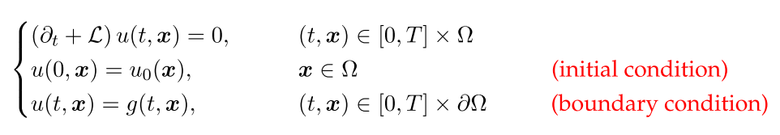
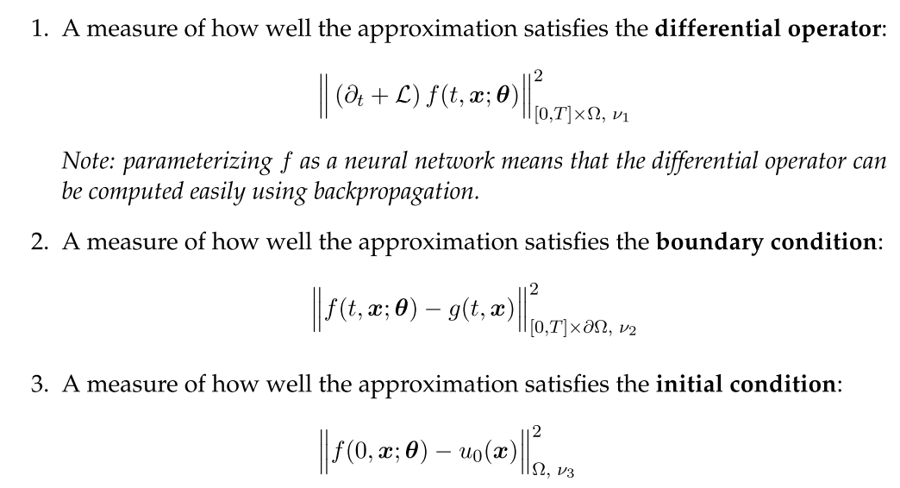
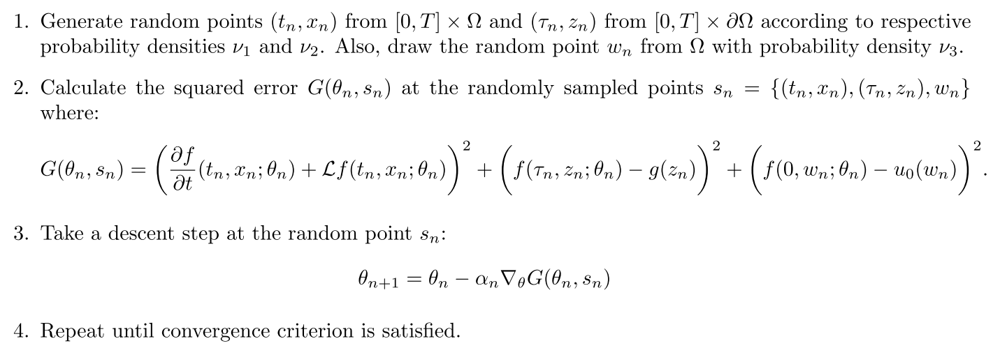
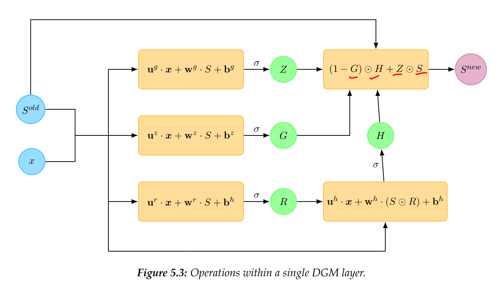
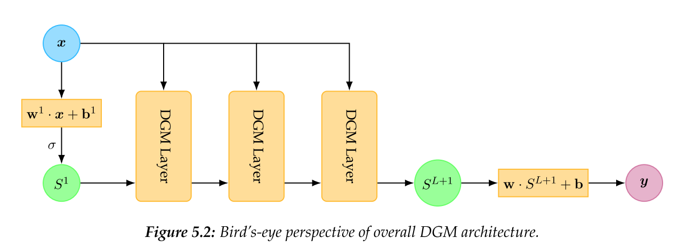

# 生物智能算法 神经网络组

## Personal information

-  name: 钟伟东
- student id: 21821073
- email: 519043202@qq.com 

## Timeine  

| Task | Due | Done |
| :-- | :-: | :-: |
| 1. 选择论文 | Mar. 14 | &radic; |
| 2. 精读论文，理解模型 | Mar. 21 | &radic; |
| 3. 复现论文 | Apr. 4 | &radic; |
| 4. 完成对比实验 | Apr. 11 | &radic; |
| 5. 形成最后报告 | Apr. 18 | &radic; |

### 1. Choose papers

[DGM: A deep learning algorithm for solving partial differential equations](https://arxiv.org/pdf/1708.07469v5.pdf)

> Journal of Computational Physics
> Volume 375, 15 December 2018, Pages 1339-1364

摘要：

> 高维偏微分方程(PDE)一直是一项长期的计算挑战。文章通过用深度神经网络近似解高维偏微分方程，神经网络经过训练以满足PDE，初始条件和边界条件。文章的算法是无网格的，通过批量随机采样的时间和空间点上训练神经网络，网格的存在会使得在较高的维度上的PDE无法求解（例如有限元，有限差分方法）。该算法在一类高维自由边界偏微分方程上进行了测试，我们能够在多达200个维度上精确求解。该算法还在高维Hamilton-Jacobi-Bellman PDE和Burgers方程上进行了测试，神经网络的解近似于Burgers方程的一般解，在连续的不同边界条件和物理条件下。算法称为“Deep Galerkin Method（DGM）”，因为它在原理上与Galerkin方法类似，其解由神经网络近似而不是基函数的线性组合。 

### 2. Read paper and understand

传统方法：

1. 确定性数值逼近方法（有限差分，有限元）
2. 随机性数值逼近方法（蒙特卡洛，离散SDE）

确定性方法：用网格计算，会有维度灾难，并且只能计算网格上的点，周边的点要用插值

随机性方法：只提供了在单一固定时空点上的值

> The above mentioned random numerical approximation methods involving Monte Carlo approximations typically overcome this curse of dimensionality but only provide approximations of the Kolmogorov PDE at a single fixed space-time point.

下图是一类PDE方程的数学定义，第一项为方程本身（其中u就是我们想要拟合的方程），第二项为方程初始条件，第三项为方程的边界条件。

根据这三个部分，构建三个损失函数分别对应方程，初始条件，边界条件

</img>

训练过程需要分别对方程所在的域和边界初始条件上进行采样

经过网络前向传播，计算损失反向传播更新网络参数

文章提出了新的网络层，DMG Layer，与LSTM类似在内部加入了更多的变量

</img>

整个网络结构如下，x是采样点输入，将x输入到每个DGM层中，主要目的是为了防止梯度消失，使得网络拟合效果更好

</img>

### 3. Implementation

实现代码与结果在code文件夹中

### 4. Experiment

</img>

采样数据的可视化

</img>

最终拟合结果与有限差分法拟合结果的比对

</img>

网络拟合结果与真值之间的差

### 5. Result

经过实验测试，该方法能够解决高维问题上传统方法出现维度灾难的问题，但是在使用过程中仍有很多部分（例如网络的超参数，采样的分布，PDE方程的近似推导等）需要进行调整才能获得可靠的结果，并且在初值边界处拟合较好，其他地方效果会次一点。