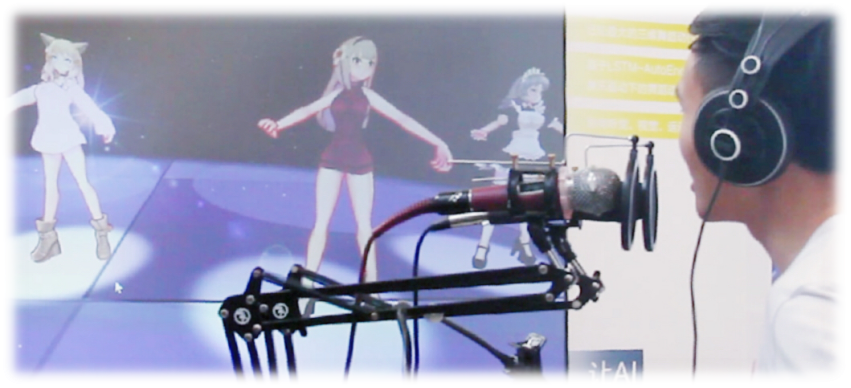
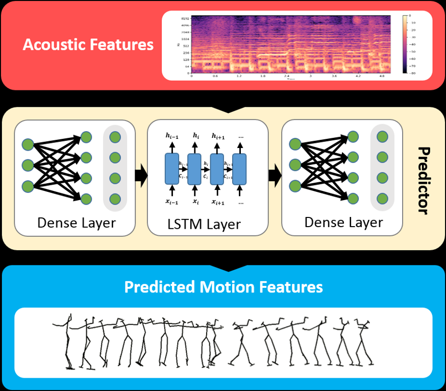
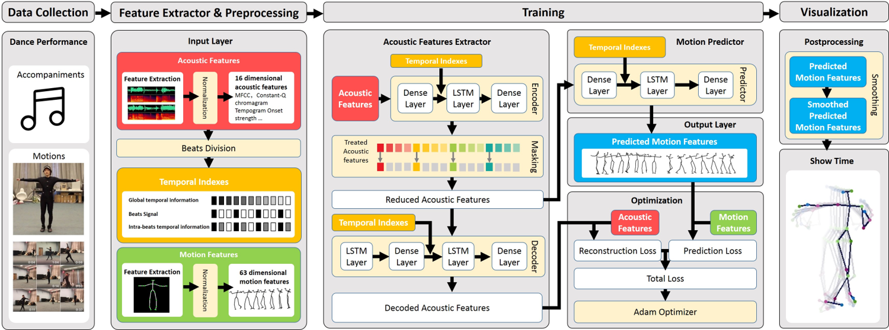
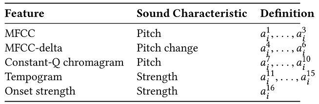
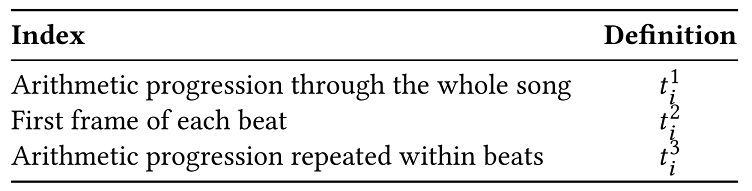

## 生物智能算法 神经网络组
#### 姓名：陆佳炜 
#### 学号：21721103
#### 邮箱：jarvis_lu@zju.edu.cn

---

## Timeine  

| Task | Due | Done |
| :- | :- | :- |
| 1. 选择综述论文 | Mar. 14 | &radic; |  
| 2. 精读论文，理解模型 | Mar. 21 | &radic; |  
| 3. 复现论文 | Apr. 4 | &radic; |  
| 4. 完成对比实验 | Apr. 11 | &radic; |  
| 5. 形成最后报告 | Apr. 18 | &radic; |  

### 1. 选择论文

      
> 主题： 基于LSTM-Autoencoder的方法进行面向音乐的舞蹈动作生成
>
> 论文： [Dance with Melody: An LSTM-autoencoder Approach toMusic-oriented Dance Synthesis](https://hcsi.cs.tsinghua.edu.cn/Paper/Paper18/MM18-TANGTAORAN.pdf)
>
> 该论文获得了 ACM MultiMedia 2018 Best Demo 的奖项

> 舞蹈和音乐具有很强的相关性。
>
> 关于如何合成面向音乐的舞蹈的研究可以促进很多领域的发展，例如：舞蹈教学、人类行为学研究。本文构建了一个基于LSTM长短时记忆网络和自编码器网络的智能系统，可以提取出从音乐特征到舞蹈特征的映射关系。并提出了加入时序索引特征和节奏筛子的方式，得到了更好的效果。
>
> 此外，该工作还建立了音乐-舞蹈的数据集，其中含有4种类型舞蹈的907,200帧3D舞蹈动作数据和对应的音乐数据。

----

### 2. 精读论文, 理解模型

- #### 2.1 模型架构

> LSTM网络在编码序列数据的Case中表现优秀，而且相比于RNN，LSTM在长期的预测上更加鲁棒。
>
> 舞蹈动作序列也是序列的一种，因此本文使用LSTM网络作为基础来对问题进行建模。
>
> 文中提到naive的做法是使用单一的LSTM网络进行建模，如下图所示：

   

     

> 该方法对音乐特征编码，加窗，每个时间步，输入一个音乐特征，通过LSTM单元输出一个动作特征。
      
        
   

#### 2.2 数据集

> [Dance Dataset](https://github.com/Jarvisss/Music-to-Dance-Motion-Synthesis)

#### 2.3 特征提取

   

> 对齐后的music使用librosa提取features。

> a)	Mfcc, mfcc_delta 人声
>
> b)	Cqt_chroma 音调
>
> c)	Onset_envelope 音量
>
> d)	Tempogram 节拍周期

   

  

> a)    使用librosa.beat.beat_track()函数计算beat，得到以上的temporal feature

   

#### 2.4 细节阐述
> a)	使用Cha-cha部分数据进行训练
>     
> b)	数据集中包含start/end_position，是由舞蹈人员给出开始/结束时间，通过fps计算。 其中start、end都是比较主观的，使用librosa重新提取节拍，然后让start等于原始start之后最近的一个拍，end等于start+动作的frame length。
>     
> c)	用新的start，end截取music帧，使之与motion帧对齐。

### 3. 复现论文和改进

> 虽然图上画的是Acoustic features作为输入，但是实际上论文中写的是Acoustic features + temporal features 作为输入，经过全连接层增加模型的非线性，然后将编码后的features输入3-layer LSTM, 每个time-step输出ht，再通过全连接层预测动作序列mt。
>
> 文中没有对全连接层的深度、宽度、激活函数作任何描述，我在实现的过程中使用2层全连接，宽度是64，Relu的方式

### 4. 对比实验

Index | Model | Strategy | Result |
|:- | :- | :- | :- |
|1 | LSTM+AutoEncoder | Base Line(Encoder LSTM, input dim:16, outputdim: 8, hidden_size:30, no dropout, seq_len:20, num_layer=3 Decoder LSTM, input dim: 8, outputdim:16, hidden_size:30, no dropout, seq_len:20, num_layer=3) | Slower convergence than naïve approach, but the result is better.(0.35 to 0.6) |  
|2 | LSTM+AutoEncoder+temporal indexes | Same as 1 | To average |  
|3 | LSTM+AutoEncoder+masking | Same as 1 | Not converge |  
|4 | LSTM+AutoEncoder+masking + temporal indexes | Same as 1 | Not converge |  
|5 | GRU+AutoEncoder+temporal+masking | Same as 1 | Litter better than 4 |  

### 5. 最终报告

[pdf](./final.pdf)

[mp4](./resources/DANCE_C_9.mp4)
